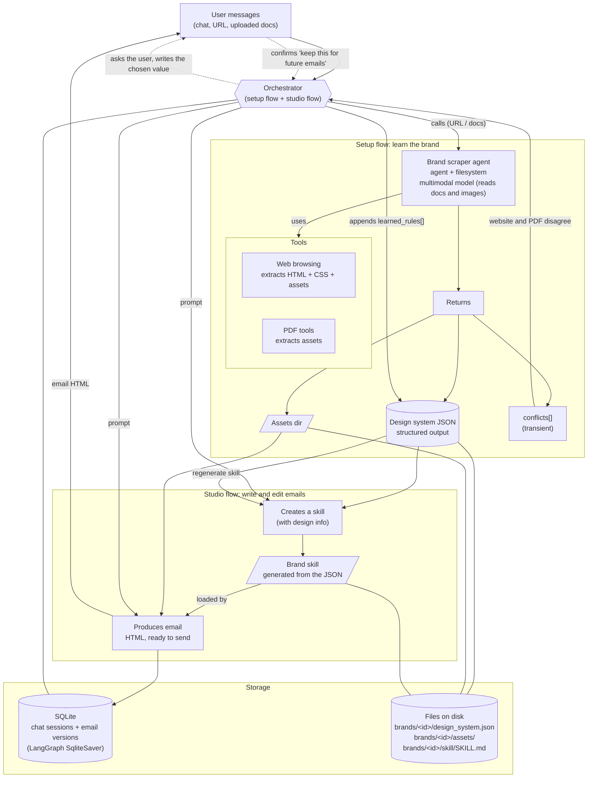

# textyess-email-agent
An agent that given a website or document copies the brand identity to craft emails

## Architecture

### Backend graph

```mermaid
flowchart TD
    USER["User messages<br/>(chat, URL, uploaded docs)"] --> ORCH

    ORCH{{"Orchestrator<br/>(setup flow + studio flow)"}}

    subgraph SETUP["Setup flow: learn the brand"]
        direction TB
        SCRAPER["Brand scraper agent<br/>agent + filesystem<br/>multimodal model (reads docs and images)"]
        subgraph TOOLS["Tools"]
            direction LR
            WEB["Web browsing<br/>extracts HTML + CSS + assets"]
            PDF["PDF tools<br/>extracts assets"]
        end
        SCRAPER -- uses --> TOOLS
        SCRAPER --> RET["Returns"]
        RET --> DS[("Design system JSON<br/>structured output")]
        RET --> ASSETS[/"Assets dir"/]
        RET --> CONF["conflicts[]<br/>(transient)"]
    end

    subgraph STUDIO["Studio flow: write and edit emails"]
        direction TB
        SKILLGEN["Creates a skill<br/>(with design info)"]
        SKILL[/"Brand skill<br/>generated from the JSON"/]
        EMAIL["Produces email<br/>HTML, ready to send"]
        SKILLGEN --> SKILL
        SKILL -- loaded by --> EMAIL
    end

    ORCH -- "calls (URL / docs)" --> SCRAPER
    CONF -- "website and PDF disagree" --> ORCH
    ORCH -. "asks the user, writes the chosen value" .-> USER

    DS --> SKILLGEN
    ASSETS --> EMAIL

    ORCH -- "prompt" --> EMAIL
    ORCH -- "prompt" --> SKILLGEN
    EMAIL --> STORE
    EMAIL -- "email HTML" --> USER

    USER -. "confirms 'keep this for future emails'" .-> ORCH
    ORCH -- "appends learned_rules[]" --> DS
    DS -- "regenerate skill" --> SKILLGEN

    subgraph STORAGE["Storage"]
        STORE[("SQLite<br/>chat sessions + email versions<br/>(LangGraph SqliteSaver)")]
        FILES[("Files on disk<br/>brands/&lt;id&gt;/design_system.json<br/>brands/&lt;id&gt;/assets/<br/>brands/&lt;id&gt;/skill/SKILL.md")]
    end
    DS --- FILES
    ASSETS --- FILES
    SKILL --- FILES
    ORCH --- STORE
```
